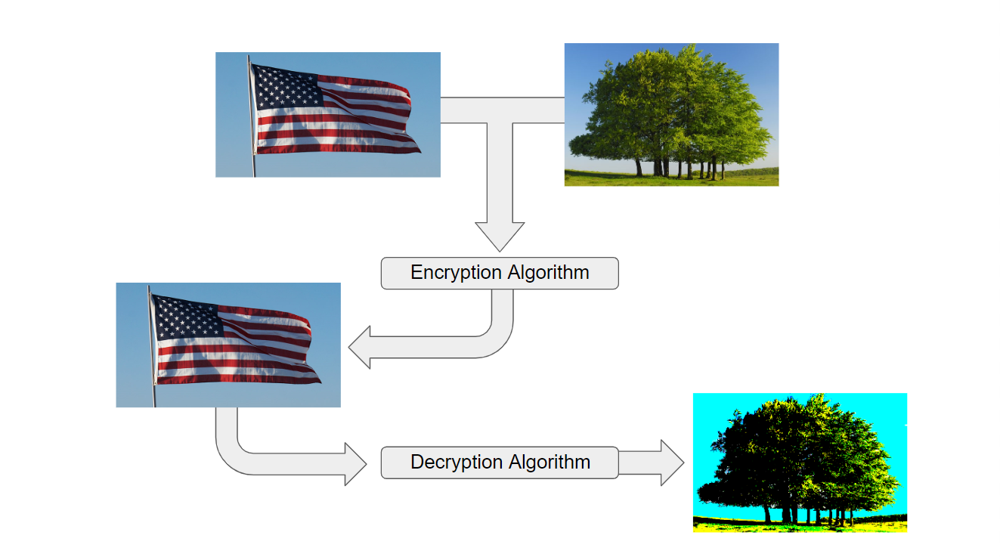

# Steganography.py

Steganography.py is an entry-level steganography project by Ethan Genser. It encodes the color values for each pixel on the secret image in the last bit of the color values in the coresponding pixels on the cover image.



## Prerequisites

Before you can run this program, ensure that yoou have the following software installed and functional:
* Python 3.5.2 or better
* PIL version 5.0.0 or better

## Running

__With default implementation:__

Before starting this program, simply ensure that the files `Implementation.py` and `Steganography.py` are in the same folder. Then, open `Implementation.py` in a compatible Python terminal. The program will ask you whether you would like to encrypt or decrypt an image. If you have never used the program before, start off by typing 'encrypt' and pressing enter/return. The program when proceed to ask for the location of two images. The first image will be the cover image. The second image is the secret image that is hidden inside the cover image. The two images do not have to be the same size, however, the program will normalize the dimensions of both the cover image and hidden image before encoding. This means the resulting encoded image will have the width of the thinnest image and the height of the shortest image.  After the program finishes execution, it will save the encrypted image with the name `Encrypted_Image.png`. You can now use the program to retrieve the hidden image back from the encryted image. To do this, start `Implementation.py` and type 'decrypt' and press enter/return. The program will ask for the location of the image. Once you have entered the encrypted image's location, the program will begin the decryption process. When complete, the recovered image will be saved with the name 'Decrypted_Image.png'.

__With custom implementation:__

To use the Steganography module in your own custom program, add the following line to the top of your program:

```import Steganography as sg```

After this, the module's two basic functions `encrypt` and `decrypt` will become available for use. The `encrypt` function takes two images as arguments and return a single, encrypted image. The `decrypt` function takes a single, encrypted image and, as the name implies, returns the decrypted image hidden inside.

## Image Format Support

Steganography.py is based on PIL v5.0.0. As such, the program is only capable of loading images with PIL compatible file extensions. In addition, some image formats that are supported by the PIL library may not be supported by Steganography.py. Listed bellow are the currently supported file extension supported by Steganography.py (Attempt to load any file not included in the list bellow, may cause the program to not function properly or crash). A full list of the PIL library's compatible image formats can be found [here](http://pillow.readthedocs.io/en/stable/handbook/image-file-formats.html.).
* __PNG__

## File Summaries

Bellow is the a list of each program file and a brief explanation of its role:

* [__Implementation.py:__](Implementation.py) This is an example of how Steganography.py can be implemented in a project.
* [__Steganography.py:__](Steganography.py) This is the main module. Contains the `encrypt` and `decrypt` functions.

## Authors

* [**Ethan Genser**](https://github.com/Ethan-Genser) - *Creator*

## License

This project is licensed under the Apache License Version 2.0 - see the [LICENSE](LICENSE) file for details.
